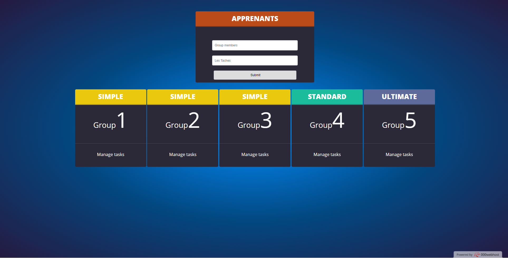

* It was a situation in our workflow where we had to make random groups to get to work. 
* We strugled thinking about making it 100% random and fair at the same time . 
* so a couple of mates  and me decided to create this project to help us create 5 groups from 26 people randomly generated 
* that was the result .

** you can try it out from here 